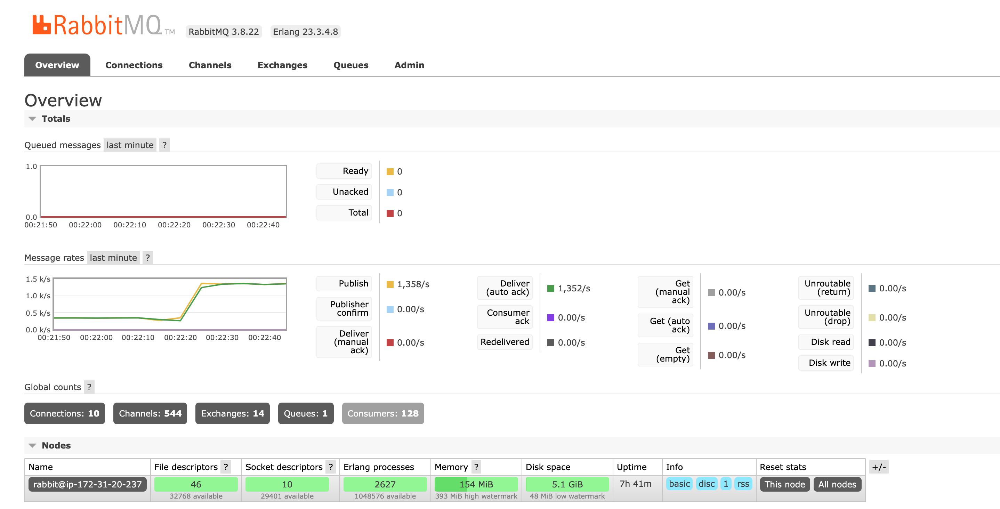

# Github Repo Link

https://github.com/qhb1001/CS6650-Assignment2

# 1. Server Design

## 1. 1 Overview

The server implementation includes two tools: servlet and RabbitMQ. Once a post request is received, the server constructs a request entity `SkierServletPostResponse` based on the request and pushes the json format of the data to the RabbitMQ. In this case, the server is only responsible for accepting the user requests, and delivers the computation task to the consumer of the RabbitMQ. 

Overrall, there are five EC2 instances running behind the server. One instance is dedicated to the RabbitMQ server. The other four instances form a target group behind the load balancer. The RabbitMQ consumer is in one of the four Tomcat web application servers. (That's because AWS always terminates my sixth instances, and I don't know why..) It turns out that five EC2 instances works fine for the given task. 

## 1.2 New Classes compared to the last server implementation

### 1.2.1 `RabbitMQDriver` class

This class is responsible for the management of the RabbitMQ connections. It is responsible to fetch the necessary information to connect to the RabbitMQ, and return the connection factory.

I realized that it was very bad to directly store the credential information in the code. The correct way to fetch the important information such as ip address, user name or password, is to store it in a third place, where the program is able to fetch these information by specifying the key to the credentials. So I stored all of them in the environment variables, and the program will fetch these information during runtime. 

Another benefit is that we can modify the resources of the program by simply changing the environment variables, rather than modify the code. It makes the configuration change very easy. 

### 1.2.2 `ChannelPool` interface and its implementation `BlockingChannelPool`

The channel pool is used to reduce the connection time between the Tomcat server and the RabbitMQ server. Here I made use of the Blocking queue to manage the pool. The interface `ChannelPool` adopted the singleton pattern so that only one blocking queue exists in the lifetime of the program. 

It supports three methods:

*   `init()`: initialize the channel pool. It would do nothing if the channel pool has been initialized. 
*   `take()`: borrow one channel from the pool if the blocking queue is not empty. Otherwise the thread is blocked.
*   `add()`: add one channel to the pool. 

## 1.3 How messages get sent/received

After the Tomcat server receives the user request, it would constructs a json message including the necessary information to describe the request. The message is sent to the RabbitMQ queue, waiting for the processing of RabbitMQ consumer. 

Once one of the thread in RabbitMQ consuer is free, it will fetch one message from the RabbitMQ. Thus, the request finally starts to be processed. Currently, the consumer only stores the information to one hash map. After that, the user request is finished. 

# 2. Test Runs

## 2.1 64-Threads

*   number of Tomcat servers: 4
*   number of channels in each Tomcat server: 64
*   number of threads in the consumer: 128
*   basicQos for each channel in consumer: 10

## 2.2 128-Threads

*   number of Tomcat servers: 4
*   number of channels in each Tomcat server: 64
*   number of threads in the consumer: 128
*   basicQos for each channel in consumer: 10

## 2.3 256-Threads

*   number of Tomcat servers: 4
*   number of channels in each Tomcat server: 64
*   number of threads in the consumer: 128
*   basicQos for each channel in consumer: 10

## 2.4 512-threads

*   number of Tomcat servers: 4
*   number of channels in each Tomcat server: 64
*   number of threads in the consumer: 256
*   basicQos for each channel in consumer: 10

